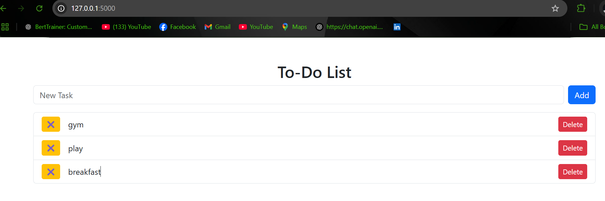

# 📝 Flask To-Do List App

A simple **To-Do List** application built using **Flask, Jinja2, SQLite, and Bootstrap**.

## 🚀 Features
- ✅ Add, Delete, and Mark Tasks as Completed
- 🗄️ SQLite Database for Task Storage
- 🎨 Bootstrap for Styling
- 🖥️ Flask Backend with Jinja2 Templating
- 🌐 RESTful API with GET, POST, and DELETE Methods

## 🛠️ Tech Stack Used
- **Backend**: Flask (Python)
- **Frontend**: HTML, Jinja2, Bootstrap
- **Database**: SQLite
- **API**: RESTful (GET, POST, DELETE)

## 📦 Installation Guide
### 1️⃣ Clone the Repository
```bash
git clone https://github.com/your-username/todo-list-flask.git
cd todo-list-flask
```

### 2️⃣ Create and Activate Virtual Environment
```bash
python -m venv venv
# Activate on Windows
venv\Scripts\activate
# Activate on Mac/Linux
source venv/bin/activate
```

### 3️⃣ Install Dependencies
```bash
pip install -r requirements.txt
```

### 4️⃣ Initialize the Database
```bash
python -c "from app import db; db.create_all()"
```

### 5️⃣ Run the Flask App
```bash
python app.py
```
Now, open [http://127.0.0.1:5000/](http://127.0.0.1:5000/) in your browser.

## 🎯 API Endpoints
| Method | Endpoint       | Description            |
|--------|--------------|------------------------|
| GET    | `/`          | Fetch all tasks       |
| POST   | `/add`       | Add a new task        |
| POST   | `/delete/<id>` | Delete a task         |
| POST   | `/toggle/<id>` | Toggle task status    |

## 🖼️ App Screenshot


## 📜 .gitignore File
```
venv/
__pycache__/
todo.db
*.pyc
*.pyo
*.log
```

## 📃 License
This project is **open-source** and free to use!
